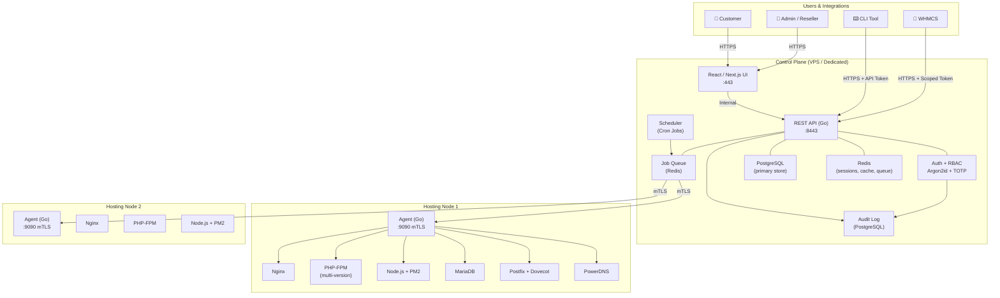
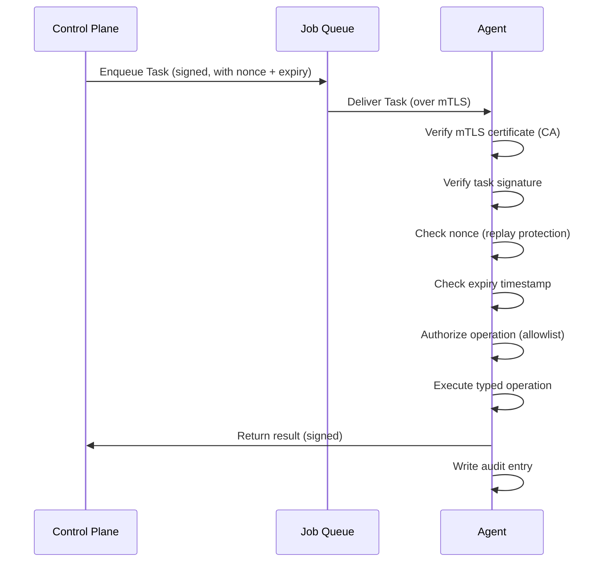
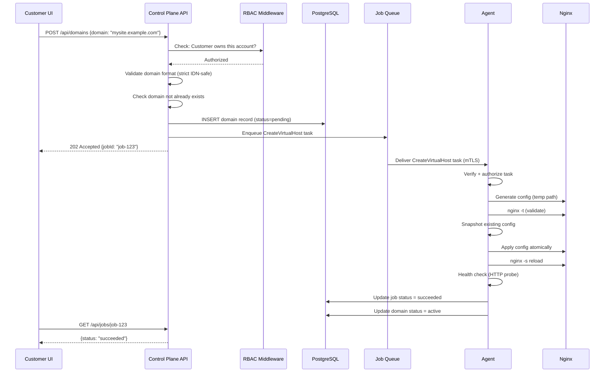
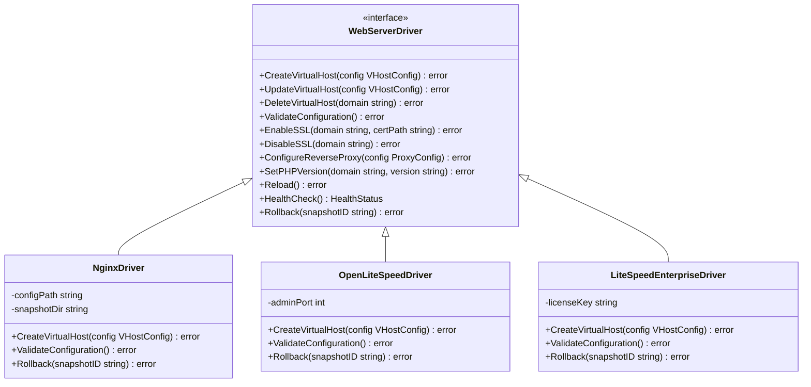

# System Architecture

> **Phase:** 1 | **Status:** Complete | **Last Updated:** 2026-09-21

---

## Overview

Hosting Panel is a **multi-server, API-first hosting control panel** built on a
Control Plane + Agent architecture. The Control Plane manages all user-facing operations,
while lightweight Agents run on each hosting node and execute only typed, allowlisted
operations.

---

## High-Level Architecture



---

## Control Plane Components

### Web UI (`frontend/`)
- **Technology:** React / Next.js
- **Serves:** Admin panel, Reseller dashboard, Customer portal
- **Auth:** Session cookies (HttpOnly, Secure, SameSite=Strict)
- **CSRF:** Double-submit cookie or synchronizer token pattern
- **Important:** UI performs **no authorization** — all checks are backend-enforced

### REST API (`control-plane/`)
- **Technology:** Go
- **Port:** 8443 (TLS)
- **Auth:** Session tokens + API tokens (scoped, rotatable)
- **RBAC:** Enforced on every endpoint via middleware
- **Rate limiting:** Per-user and per-IP
- **Audit:** Every privileged action logged

### Job Queue & Scheduler
- **Technology:** Redis-backed job queue
- **Purpose:** Async execution of agent tasks
- **Guarantees:** At-least-once delivery with idempotency keys
- **Retry:** Exponential backoff with max attempts
- **Timeout:** Per-task timeout enforced

### Database (PostgreSQL)
- **Binding:** `127.0.0.1` only — never public
- **Migrations:** Versioned, forward-only, with rollback scripts
- **Encryption:** Sensitive fields encrypted at rest (secrets, keys)
- **Backups:** Integrated with backup subsystem

### Cache (Redis)
- **Binding:** `127.0.0.1` only — never public
- **Uses:** Session store, job queue, rate limiting, temp caches
- **No persistence for sensitive data** — sessions invalidated on restart if needed

---

## Server Agent

### Purpose
The Agent is a **small, privileged Go service** running on each hosting node.
It exposes **only typed, allowlisted operations** — never a generic shell endpoint.

### Allowed Operations (Typed API)
```
User Management:    CreateHostingUser, LockUser, UnlockUser, DeleteUser
Web Server:         CreateVirtualHost, UpdateVirtualHost, DeleteVirtualHost,
                    ValidateConfig, EnableSSL, DisableSSL, Reload, Rollback
PHP:                SetPHPVersion, CreateFPMPool, DeleteFPMPool, ReloadFPM
Node.js:            CreateApp, StartApp, StopApp, RestartApp, GetAppStatus, DeleteApp
Database:           CreateDatabase, DeleteDatabase, CreateDBUser, RotateDBPassword
DNS:                CreateZone, DeleteZone, CreateRecord, UpdateRecord, DeleteRecord
Mail:               CreateMailbox, DeleteMailbox, SetMailboxQuota, CreateAlias
Backup:             RunBackup, RunRestore, VerifyBackup
Firewall:           ApplyRuleSet
Monitoring:         GetSystemMetrics, GetServiceStatus
```

### What the Agent NEVER does
- ❌ Execute arbitrary shell commands from web input
- ❌ Accept `executeShell(command)` style requests
- ❌ Run without mTLS authentication
- ❌ Trust task payloads without signature verification
- ❌ Bind to a public interface without explicit configuration

### Agent Security Model


---

## Request Flow: Create a New Domain



---

## Web Server Driver Architecture



**Safe Config Apply Sequence (all drivers must follow):**
```
1. Generate config → temp path
2. Validate config (nginx -t / equivalent)
3. Snapshot current config
4. Apply atomically
5. Reload web server
6. Health check (HTTP probe to domain)
7. If OK → commit | If FAIL → automatic rollback to snapshot
```

---

## Network Architecture

```
Internet
   │
   ▼
[Firewall / nftables]
   │
   ├─► :80, :443  → Nginx (customer sites)
   ├─► :8443      → Control Plane API (admin only, IP restricted if possible)
   └─► :9090      → Agent (Control Plane only, not public)

Internal (127.0.0.1 / private network only):
   ├─ PostgreSQL  :5432
   ├─ Redis       :6379
   ├─ MariaDB     :3306
   └─ PHP-FPM     unix sockets only
```

### Firewall Rules (nftables — default policy: drop)
| Port | Protocol | From | To | Purpose |
|------|----------|------|----|---------|
| 80 | TCP | Any | Node | HTTP (ACME challenges, redirect) |
| 443 | TCP | Any | Node | HTTPS (customer sites) |
| 8443 | TCP | Admin IPs | Control Plane | Panel UI/API |
| 9090 | TCP | Control Plane IP | Node | Agent (mTLS) |
| 22 | TCP | Admin IPs | All | SSH (management) |

---

## Technology Stack Summary

| Layer | Technology | Notes |
|-------|-----------|-------|
| Backend | Go 1.22+ | Control Plane + Agent |
| Frontend | React / Next.js | Admin + Customer UI |
| Primary DB | PostgreSQL 15+ | Private binding |
| Cache/Queue | Redis 7+ | Private binding |
| Web Server | Nginx (default) | Driver-based |
| PHP | PHP-FPM (multi-version) | Per-account pools |
| Node.js | PM2 | Controlled process manager |
| DNS | PowerDNS | Via abstraction layer |
| Mail | Postfix + Dovecot + Rspamd | Standard stack |
| SSL | ACME (Let's Encrypt compatible) | Automated renewal |
| Backup | Restic + Rclone | Encrypted repos |
| Firewall | nftables | Abstraction layer |
| Auth | Argon2id + TOTP | MFA first-class |
| Certs | mTLS (custom CA) | Agent communication |

---

## Deployment Model

```
┌─────────────────────────────────────────┐
│         Control Plane Server            │
│                                         │
│  ┌──────────┐  ┌──────────┐            │
│  │  Web UI  │  │  API     │            │
│  │ (Next.js)│  │  (Go)    │            │
│  └──────────┘  └──────────┘            │
│  ┌──────────┐  ┌──────────┐            │
│  │PostgreSQL│  │  Redis   │            │
│  └──────────┘  └──────────┘            │
└────────────────────┬────────────────────┘
                     │ mTLS :9090
         ┌───────────┴───────────┐
         ▼                       ▼
┌─────────────────┐   ┌─────────────────┐
│  Hosting Node 1 │   │  Hosting Node 2 │
│  ┌───────────┐  │   │  ┌───────────┐  │
│  │   Agent   │  │   │  │   Agent   │  │
│  │   (Go)    │  │   │  │   (Go)    │  │
│  └───────────┘  │   │  └───────────┘  │
│  Nginx          │   │  Nginx          │
│  PHP-FPM        │   │  PHP-FPM        │
│  Node.js/PM2    │   │  Node.js/PM2    │
│  MariaDB        │   │  MariaDB        │
│  Postfix+Dov.   │   │  Postfix+Dov.   │
│  PowerDNS       │   │                 │
└─────────────────┘   └─────────────────┘
```

---

## Key Design Decisions

| Decision | Choice | Rationale |
|----------|--------|-----------|
| Backend language | Go | Performance, static binaries, strong stdlib for networking/crypto |
| Agent pattern | Typed operations only | Eliminates shell injection attack surface |
| DB primary | PostgreSQL | Reliability, ACID, strong typing |
| Web server default | Nginx | Stability, wide support, well-understood security model |
| Driver pattern | Interface/Adapter | Future extensibility for OLS/LiteSpeed without changing core |
| Auth hashing | Argon2id | Current best practice for password hashing |
| Agent auth | mTLS | Mutual certificate authentication, not just server TLS |
| Backup tool | Restic | Content-addressable, encrypted, deduplication, many backends |
