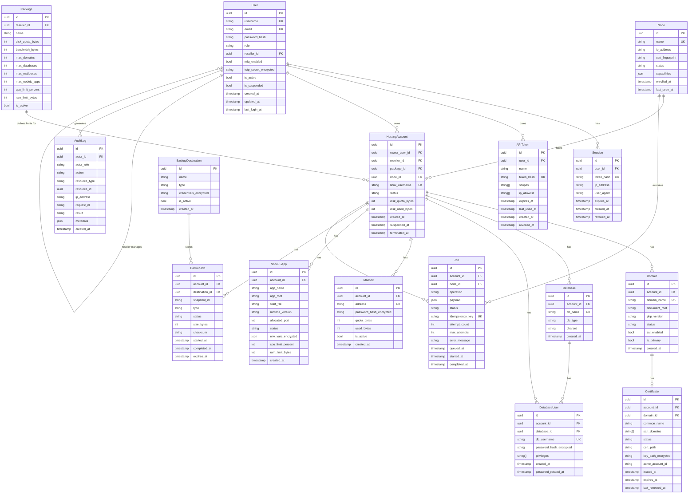

# Data Model

> **Phase:** 1 | **Last Updated:** 2026-09-21

---

## Overview

This document defines the core data entities, their relationships, and key field-level
security considerations. All data is stored in PostgreSQL unless noted otherwise.

---

## Entity Relationship Diagram



---

## Security-Sensitive Fields

### Encrypted at Rest

The following fields are encrypted using AES-256-GCM with a key from the secret store.
They are **never stored in plaintext** in the database:

| Table | Field | Notes |
|-------|-------|-------|
| `User` | `totp_secret_encrypted` | TOTP seed |
| `Certificate` | `key_path_encrypted` | Path to TLS private key |
| `DatabaseUser` | `password_hash_encrypted` | Encrypted DB password |
| `Mailbox` | `password_hash_encrypted` | Encrypted mailbox password |
| `NodeJSApp` | `env_vars_encrypted` | Application environment variables |
| `BackupDestination` | `credentials_encrypted` | S3/SFTP credentials |

### Never Returned in API Responses

| Table | Field | Why |
|-------|-------|-----|
| `User` | `password_hash` | Never needed after storage |
| `User` | `totp_secret_encrypted` | Only used for verification |
| `Certificate` | `key_path_encrypted` | Private key must not be exposed |
| `DatabaseUser` | `password_hash_encrypted` | Returned only at initial creation |
| `APIToken` | `token_hash` | Raw token shown only at creation |
| `BackupDestination` | `credentials_encrypted` | Never exposed to customers |

### Append-Only Tables

| Table | Reason |
|-------|--------|
| `AuditLog` | Immutable audit trail; rows are never updated or deleted |
| `BackupJob` | Backup history integrity |

---

## Key Design Decisions

### UUIDs for Primary Keys
All primary keys use UUID v4 to prevent:
- Sequential ID enumeration (IDOR attacks)
- Predictable resource IDs

### Soft Deletes for Critical Resources
`HostingAccount`, `Domain`, `Database`, `Mailbox` use soft deletes:
- `terminated_at` or `deleted_at` timestamp set instead of row deletion
- Allows audit trail and potential recovery
- Background job eventually cleans up after retention period

### Node Assignment
`HostingAccount.node_id` determines which physical server the account lives on.
Multi-node future: accounts can be migrated between nodes via a controlled migration job.

### Idempotency Keys on Jobs
`Job.idempotency_key` ensures that the same operation submitted multiple times
(e.g., from WHMCS retry or network timeout) only executes once.

---

## Indexes (Performance + Security)

```sql
-- Auth lookups
CREATE UNIQUE INDEX idx_users_email ON users(email);
CREATE UNIQUE INDEX idx_users_username ON users(username);
CREATE UNIQUE INDEX idx_sessions_token_hash ON sessions(token_hash);
CREATE UNIQUE INDEX idx_api_tokens_hash ON api_tokens(token_hash);

-- Resource ownership lookups (prevent IDOR)
CREATE INDEX idx_domains_account_id ON domains(account_id);
CREATE INDEX idx_databases_account_id ON databases(account_id);
CREATE INDEX idx_mailboxes_account_id ON mailboxes(account_id);
CREATE INDEX idx_nodejs_apps_account_id ON nodejs_apps(account_id);
CREATE INDEX idx_jobs_account_id ON jobs(account_id);
CREATE INDEX idx_backup_jobs_account_id ON backup_jobs(account_id);

-- Audit log queries
CREATE INDEX idx_audit_log_actor ON audit_log(actor_id, created_at DESC);
CREATE INDEX idx_audit_log_resource ON audit_log(resource_type, resource_id);

-- Node operations
CREATE INDEX idx_jobs_node_status ON jobs(node_id, status);
CREATE UNIQUE INDEX idx_jobs_idempotency ON jobs(idempotency_key);
```

---

## Data Retention Policy

| Data Type | Retention | Notes |
|-----------|-----------|-------|
| Active sessions | Until expiry or revocation | Max 24h by default |
| Expired sessions | 7 days | Then purged |
| Audit logs | 1 year minimum | Configurable; export recommended |
| Backup history | Per backup retention policy | Typically 30–90 days |
| Terminated accounts | 30 days soft-deleted | Then hard delete |
| Job records | 90 days | Completed jobs |
| Error logs | 30 days | Server-side only |

---

## Migration Strategy

- All schema changes via numbered migration files in `/migrations/`
- Migrations are forward-only in production
- Rollback scripts provided for each migration
- No destructive migrations without explicit backup step in migration script
- Pre-migration checks (e.g., verify table exists, check row counts) run before apply
