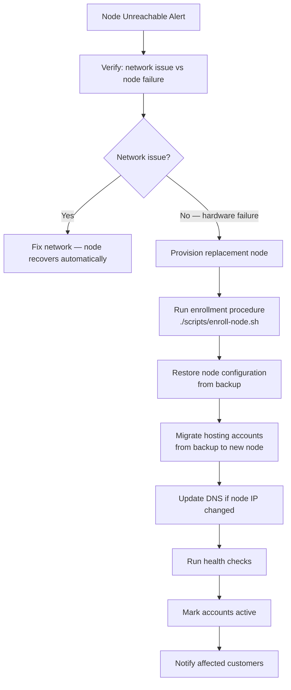
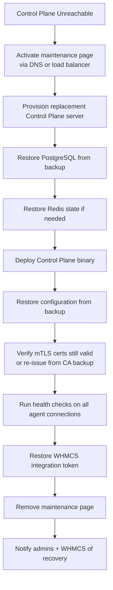
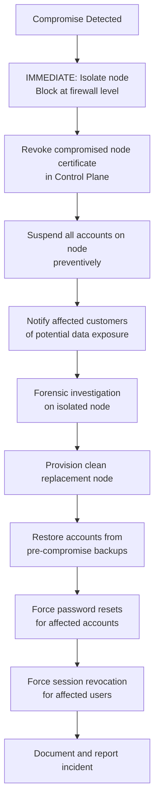

# Disaster Recovery

> **Phase:** 1 | **Last Updated:** 2026-09-21

---

## Overview

This document defines disaster recovery (DR) scenarios, recovery procedures, and
target objectives for the Hosting Panel platform.

---

## Recovery Objectives

| Metric | Target | Notes |
|--------|--------|-------|
| **RTO** (Recovery Time Objective) | < 4 hours | Time to restore service after disaster |
| **RPO** (Recovery Point Objective) | < 24 hours | Maximum acceptable data loss |
| **MTTR** (Mean Time to Recover) | < 2 hours | For common failure scenarios |

---

## Disaster Scenarios

### Scenario 1: Single Hosting Node Failure

**Description:** One hosting node becomes unreachable (hardware failure, OS crash, etc.)

**Impact:**
- All hosting accounts on that node are offline
- Control Plane continues to function
- Other nodes unaffected

**Recovery Procedure:**



**Estimated RTO:** 1–3 hours (depending on number of accounts to restore)

**Runbook Steps:**
1. Confirm node failure via monitoring dashboard
2. Set affected accounts to `suspended` status (prevents confusing errors)
3. Provision replacement node (same OS, same specs)
4. Run: `./scripts/enroll-node.sh --replacement-for <old-node-id>`
5. For each affected account: trigger restore from latest backup
6. Validate restored accounts (HTTP checks on domains)
7. Update `node_id` for accounts in Control Plane DB
8. Re-enable accounts
9. Document incident and timeline

---

### Scenario 2: Control Plane Failure

**Description:** Control Plane server fails (hardware, OS, data corruption)

**Impact:**
- Admin/customer UI unavailable
- New provisioning operations cannot be performed
- Existing hosting accounts continue to function (Agent runs independently)
- WHMCS provisioning fails

**Recovery Procedure:**



**Estimated RTO:** 1–2 hours

**Critical backups needed:**
- PostgreSQL database dump (automated daily)
- Control Plane TLS certificates + private keys (stored in secret backup)
- Internal CA certificate + private key (stored in **offline secure backup**)
- `.env` / secret store contents (stored in encrypted offline backup)

**Important:** Hosting accounts continue running during Control Plane outage.
Customers can still access their websites. Only the management interface is unavailable.

---

### Scenario 3: Database Corruption or Data Loss

**Description:** PostgreSQL database becomes corrupted or data is accidentally deleted

**Impact:**
- Platform may behave unpredictably
- Account data may be inconsistent

**Recovery Procedure:**

1. **Stop Control Plane API** immediately to prevent further corruption
2. **Assess damage:** Is it full corruption or partial table issue?
3. **If partial:** Run targeted restore of affected tables from PostgreSQL backup
4. **If full:** Restore entire database from latest dump
5. **Run migrations** to ensure schema is current after restore
6. **Verify data integrity:** Spot-check accounts, domains, jobs
7. **Restart Control Plane API**
8. **Audit:** Review audit logs for the period of data loss

**Database Backup Schedule:**
- Full dump: every 6 hours
- WAL archiving (point-in-time recovery): if configured (Phase 20)

---

### Scenario 4: Backup Destination Failure

**Description:** Primary backup destination (e.g., S3 bucket) becomes unavailable

**Impact:**
- New backups cannot be written to that destination
- Existing backups may still be readable
- Restore may be impossible from that destination

**Recovery Procedure:**
1. Alert fires when backup job fails for > 1 hour
2. Admin switches active backup destination to secondary
3. Investigate primary destination issue
4. Once restored, sync any missed backups

**Mitigation:** Always configure at least **two destinations** (one local, one offsite).

---

### Scenario 5: Compromised Node

**Description:** A hosting node is breached (attacker has root access)

**Impact:**
- All customer data on that node potentially compromised
- Agent private key possibly stolen
- Attacker cannot directly access other nodes (isolated mTLS certs)

**Recovery Procedure:**



**Communication:** Customers must be notified of potential data exposure.
This may have legal/regulatory requirements depending on jurisdiction.

---

### Scenario 6: Admin Account Compromise

**Description:** An admin or SuperAdmin account is taken over by an attacker

**Recovery Procedure:**
1. **Immediately revoke all sessions** for the compromised account
2. **Rotate all API tokens** issued by that account
3. **Audit recent actions** in audit log for account in last 24–48 hours
4. **Reverse any malicious changes** found in audit log
5. **Use break-glass procedure** (see below) to regain admin access if needed
6. **Force MFA re-enrollment** before account is re-enabled

---

## Break-Glass Administrative Procedure

For emergency access when normal admin access is unavailable:

**Break-glass account:**
- One emergency SuperAdmin account, not used in daily operations
- Credentials stored in physical secure location (offline, not in password manager)
- MFA backup codes stored separately from primary MFA device
- Account activity monitored — any login generates immediate alert
- Credentials rotated after every use

**Emergency CLI access:**
```bash
# Direct database access for emergency recovery (requires SSH to Control Plane)
# Use only when web UI is completely unavailable
sudo -u hosting-panel /opt/hosting-panel/bin/panel-cli emergency-admin-reset \
  --username emergency_admin \
  --reason "DR procedure - incident #XYZ"
```

**Break-glass procedure:**
1. Two-person authorization required (if team > 1)
2. Document reason before using
3. All actions logged to immutable audit log
4. Rotate break-glass credentials immediately after use
5. File incident report

---

## DR Test Schedule

| Test | Frequency | Description |
|------|-----------|-------------|
| Backup restore test | Monthly | Restore one random account to staging |
| Node rebuild drill | Quarterly | Rebuild a node from scratch using documented procedure |
| Control Plane restore drill | Quarterly | Restore CP from backup to test environment |
| DB restore drill | Quarterly | Restore database and verify integrity |
| Break-glass access test | Annually | Verify break-glass procedure works |

**DR test results must be documented and stored in audit log.**

---

## HA Considerations (Future)

For higher availability (not in initial release):
- Control Plane: Active/Standby with floating IP (keepalived/VRRP)
- PostgreSQL: Streaming replication with hot standby
- Redis: Redis Sentinel or Cluster
- Multiple nodes per account (load-balanced or failover)

Initial release: Single Control Plane, multiple independent hosting nodes.
Failure of one node does not affect others. Control Plane is single point of failure
for management (but not for existing hosting operations).

---

## Contact List (Template)

```
Primary Admin:    [NAME] — [EMAIL] — [PHONE]
Secondary Admin:  [NAME] — [EMAIL] — [PHONE]
Hosting Provider: [PROVIDER] — [SUPPORT URL] — [SUPPORT PHONE]
Domain Registrar: [REGISTRAR] — [SUPPORT URL]
Backup Vendor:    [VENDOR] — [SUPPORT URL]
Security Contact: [NAME] — [EMAIL]
```

*Fill in before going to production.*
