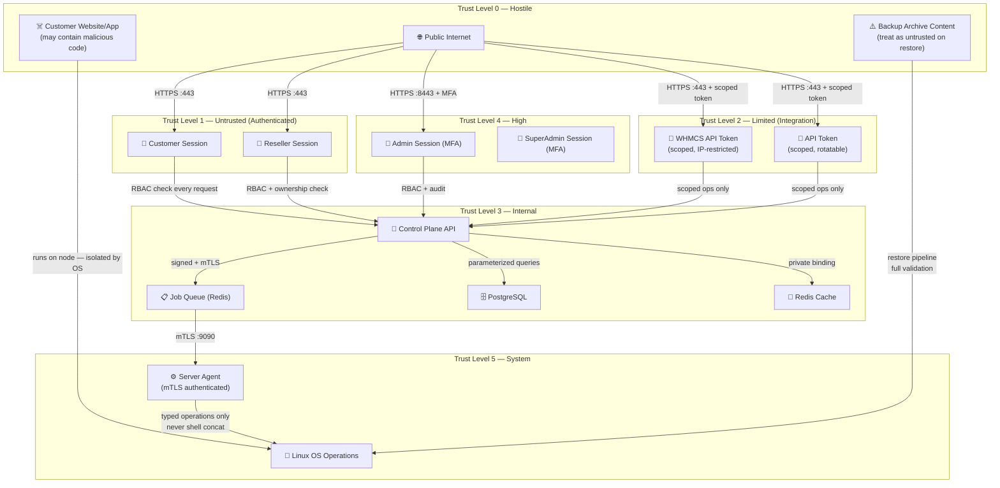

# Trust Boundaries

> **Phase:** 1 | **Last Updated:** 2026-09-21

---

## Overview

A trust boundary is a point where data crosses from one trust level to another.
**Every crossing of a trust boundary requires validation, authentication, and authorization.**

---

## Trust Level Definitions

| Level | Name | Description |
|-------|------|-------------|
| 0 | **Hostile** | Completely untrusted; treat all input as malicious |
| 1 | **Untrusted** | External users with valid credentials; verify every action |
| 2 | **Limited** | External integrations with scoped permissions |
| 3 | **Internal** | Internal services on private network; still validate |
| 4 | **High** | Authenticated admin sessions with MFA |
| 5 | **System** | OS-level privileged operations (agent internals) |

---

## Trust Boundary Map

---

## Boundary Crossing Rules

### Boundary 1: Internet → Control Plane API

**Applies to:** All external HTTP requests

| Requirement | Implementation |
|------------|---------------|
| TLS only | All traffic on HTTPS; HTTP redirected |
| Authentication | Session token or API token required for all non-public endpoints |
| Rate limiting | Per-IP and per-user rate limits on all endpoints |
| Input validation | All inputs strictly validated before processing |
| CSRF protection | Double-submit cookie or synchronizer token |
| Error messages | Generic in responses; details only in server logs |

---

### Boundary 2: Control Plane → Server Agent (mTLS)

**Applies to:** All Control Plane → Agent task delivery

| Requirement | Implementation |
|------------|---------------|
| Mutual TLS | Both sides must present valid certificates signed by internal CA |
| Task signing | Every task payload signed by Control Plane signing key |
| Nonce + timestamp | Replay attack prevention |
| Expiry | Tasks expire after configured TTL (e.g., 5 minutes) |
| Allowlist | Agent only accepts defined operation types |
| Authorization | Agent re-authorizes every operation against its own policy |
| Audit | Agent writes its own audit entry independent of Control Plane |

**Rejected by Agent:**
- Unsigned tasks
- Tasks with expired timestamps
- Tasks with replayed nonces
- Tasks requesting operations not in allowlist
- Connections without valid client certificate

---

### Boundary 3: Customer → Their Hosting Account (OS Isolation)

**Applies to:** Customer code running on hosting node

| Requirement | Implementation |
|------------|---------------|
| Separate Linux user | Each account has a dedicated system user |
| Home directory boundary | Strict `chdir` + canonical path enforcement |
| Filesystem quotas | OS-level disk quota per user |
| Process isolation | cgroups v2 / systemd slices for CPU/RAM/process limits |
| PHP isolation | Separate FPM pool per account; `open_basedir` set |
| Node.js isolation | PM2 managed process; bound to localhost only; allocated port |
| No cross-account access | Verified: User A cannot read User B files |

---

### Boundary 4: WHMCS → Provisioning API

**Applies to:** All requests using a WHMCS integration token

| Requirement | Implementation |
|------------|---------------|
| Scoped token | WHMCS token limited to provisioning operations only |
| IP allowlist | Optional but recommended; reject requests from unexpected IPs |
| Rate limiting | Strict rate limits on WHMCS endpoints |
| No admin operations | WHMCS token cannot access admin config, audit logs, or other accounts |
| Idempotency | Duplicate requests (same service ID) return same result |
| Audit trail | Every WHMCS request logged with service ID + action |

**WHMCS token is explicitly NOT allowed to:**
- Access or modify other customers' accounts (except the specific service ID)
- Read admin configuration
- Access audit logs
- Create admin or reseller users
- Modify billing packages or pricing
- Access backup destination credentials

---

### Boundary 5: Restore Pipeline → Filesystem

**Applies to:** All backup restore operations

| Requirement | Implementation |
|------------|---------------|
| Content untrusted | All archive content treated as potentially malicious |
| Path validation | Every entry checked: no `..`, no absolute paths, no symlinks to outside |
| Staging first | Restore to temp staging directory; validate; then move |
| Ownership check | Restored files set to correct account user/group |
| Size limits | Decompression with quota enforcement |
| DB restore | Controlled import only; not arbitrary SQL execution |
| Destination boundary | Restore cannot write outside account home directory |

---

### Boundary 6: File Manager → Customer Filesystem

**Applies to:** All file manager operations

| Requirement | Implementation |
|------------|---------------|
| Path canonicalization | `filepath.EvalSymlinks()` + check prefix against account root |
| Symlink protection | `O_NOFOLLOW` flag; detect symlinks outside account root |
| No `..` traversal | Reject any path that after canonicalization escapes account root |
| Absolute path rejection | Reject paths starting with `/` unless they resolve within account root |
| Operation audit | Log every file read/write/delete/move with actor and timestamp |
| Upload validation | File size limits; MIME type checking; archive inspection |

---

## What Crosses Boundaries and is NEVER Trusted

| Data | Boundary | Treatment |
|------|---------|-----------|
| Domain names from user | Internet → API | Validate against strict regex; IDN-safe normalization |
| Filenames from user | API → File Manager | Canonical path check; reject traversal |
| SQL input from user | API → DB | Parameterized queries; never concatenated |
| Shell arguments from user | API → Agent | Argument arrays; fixed executable paths |
| Archive content during restore | Backup → Filesystem | Full path validation; staging |
| WHMCS package name | WHMCS → Provisioning | Map to internal package; never trust external package name |
| Customer-set PHP settings | API → PHP-FPM | Validate against allowlist |
| Env variable names/values for Node.js | API → Agent | Validate name + sanitize value; redact in logs |

---

## Trust Boundary Violations = Security Gate Failure

If any code is found that:
- Passes user input directly to shell without argument-array execution
- Trusts client-supplied owner IDs or role claims without backend verification
- Accepts raw SQL from user input
- Allows file operations outside canonicalized account root
- Returns secrets in API responses
- Skips mTLS validation for agent communication

→ **This is a security gate failure. Do not proceed to the next phase.**
