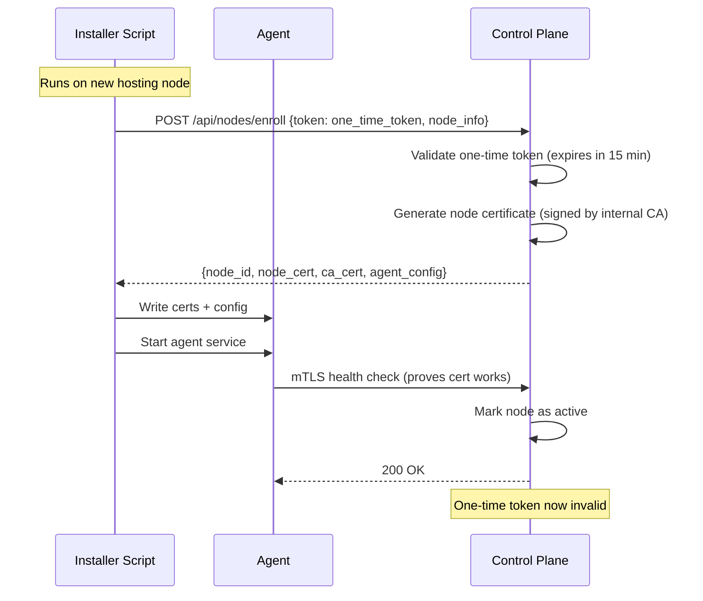
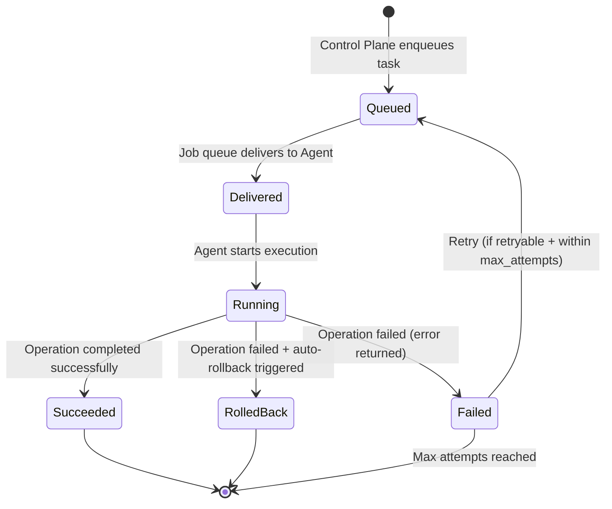
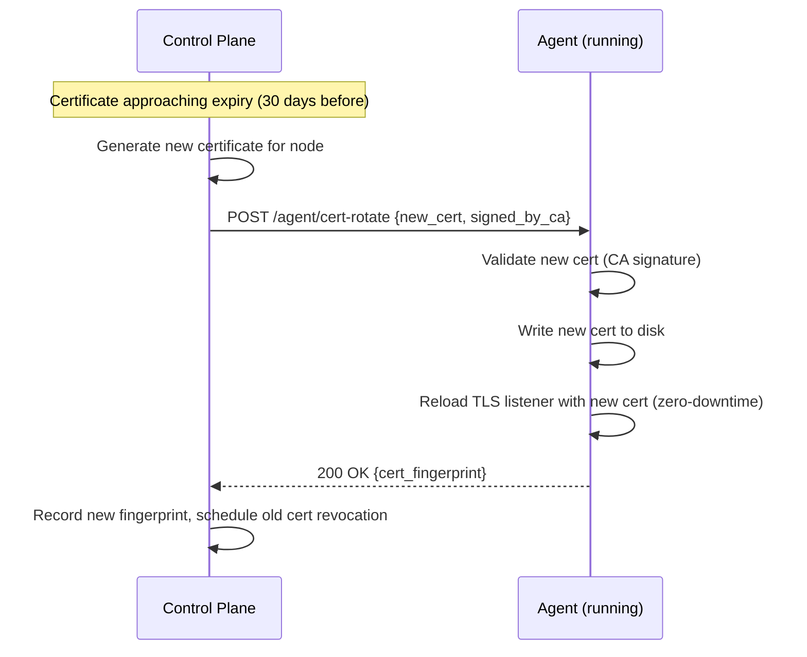

# Agent Protocol

> **Phase:** 1 | **Last Updated:** 2026-09-21

---

## Overview

The Agent Protocol defines how the Control Plane communicates with Server Agents.
All communication is **mutually authenticated via TLS (mTLS)**, and every task payload
is **signed, time-bounded, and replay-protected**.

---

## Transport Layer: mTLS

```
Control Plane                    Agent
     │                              │
     │──── TLS ClientHello ────────►│
     │◄─── Server Certificate ──────│  (Agent cert signed by internal CA)
     │──── Client Certificate ─────►│  (Control Plane cert signed by internal CA)
     │◄─── Certificate verified ────│
     │──── Mutual auth complete ────►│
     │                              │
     │   Encrypted channel ready   │
```

**Certificate Authority:** Internal CA managed by Control Plane.
- CA certificate is distributed to all agents at enrollment
- Each node has a unique certificate (CN = node name / ID)
- Certificates are rotatable without service disruption

**Agent binds to:** `<node_private_ip>:9090`
- Never bound to `0.0.0.0` by default
- Firewall rule: accept only from Control Plane IP(s)

---

## Node Enrollment Flow



**One-time enrollment token:**
- Generated by SuperAdmin in Control Plane UI
- Expires after 15 minutes or first use (whichever comes first)
- Transmitted only over HTTPS to installer
- Never logged in plain form

---

## Task Envelope (JSON Schema)

Every task sent from Control Plane to Agent has this structure:

```json
{
  "envelope": {
    "version": "1",
    "task_id": "task_01j8abc123def456",
    "request_id": "req_01j8xyz789",
    "node_id": "node-prod-01",
    "issued_at": "2026-09-21T10:00:00Z",
    "expires_at": "2026-09-21T10:05:00Z",
    "nonce": "a3f8b2c91d4e5f6a7b8c9d0e1f2a3b4c",
    "idempotency_key": "idem_createvhost_example_com_v1"
  },
  "operation": "CreateVirtualHost",
  "payload": {
    "domain": "example.com",
    "account_user": "hosting_user_123",
    "document_root": "/home/hosting_user_123/public_html",
    "php_version": "8.3",
    "ssl": false
  },
  "signature": "base64-encoded-HMAC-SHA256-or-Ed25519-signature"
}
```

### Envelope Fields

| Field | Type | Description |
|-------|------|-------------|
| `version` | string | Protocol version for forward compatibility |
| `task_id` | string | Unique task ID (ULID recommended) |
| `request_id` | string | Traces back to originating API request |
| `node_id` | string | Target node — agent rejects tasks for other nodes |
| `issued_at` | ISO8601 | Task creation time (UTC) |
| `expires_at` | ISO8601 | Task expiry — agent rejects after this time |
| `nonce` | hex string | Random 32-byte nonce for replay protection |
| `idempotency_key` | string | Safe retry key — same key = same result, no duplicate execution |

### Signature

- Algorithm: **Ed25519** (preferred) or HMAC-SHA256
- Signing key held by Control Plane; public key distributed to agents at enrollment
- Signature covers: `version + task_id + node_id + issued_at + expires_at + nonce + operation + payload` (canonically serialized)

---

## Replay Protection

The agent maintains a **nonce store** (in-memory + persistent if agent restarts):

```
On receiving task:
1. Check expires_at > now()             → reject if expired
2. Check issued_at within clock skew    → reject if > 30s in future
3. Look up nonce in seen_nonces store   → reject if already seen
4. If all pass: execute operation
5. Store nonce in seen_nonces (TTL = 2 × max_task_lifetime)
```

**Clock skew tolerance:** ±30 seconds (NTP required on all nodes)
**Nonce store TTL:** 10 minutes (2 × 5-minute task lifetime)

---

## Task Lifecycle



### Task States

| State | Description |
|-------|-------------|
| `queued` | Task in job queue, not yet delivered |
| `delivered` | Task delivered to agent, awaiting execution |
| `running` | Agent actively executing the operation |
| `succeeded` | Operation completed successfully |
| `failed` | Operation failed; error details recorded |
| `rolled_back` | Operation failed; automatic rollback was executed |

---

## Allowed Operations Reference

### Full Allowlist

```
# User Management
CreateHostingUser(username, uid, home_dir, quota_bytes)
LockHostingUser(username)
UnlockHostingUser(username)
DeleteHostingUser(username, backup_first bool)

# Web Server
CreateVirtualHost(domain, account_user, doc_root, php_version, ssl bool)
UpdateVirtualHost(domain, changes VHostChanges)
DeleteVirtualHost(domain)
ValidateWebServerConfig()
EnableSSL(domain, cert_path, key_path)
DisableSSL(domain)
ConfigureReverseProxy(domain, upstream_addr, upstream_port)
ReloadWebServer()
RollbackWebServerConfig(snapshot_id)
GetWebServerHealth() HealthStatus

# PHP
SetPHPVersion(domain, version string)
CreateFPMPool(account_user, php_version, socket_path)
DeleteFPMPool(account_user, php_version)
ReloadPHPFPM(php_version)

# Node.js
CreateNodeApp(account_user, app_name, app_root, start_file, env_vars map)
StartNodeApp(account_user, app_name)
StopNodeApp(account_user, app_name)
RestartNodeApp(account_user, app_name)
GetNodeAppStatus(account_user, app_name) AppStatus
DeleteNodeApp(account_user, app_name)

# Database (MariaDB)
CreateDatabase(db_name, account_user)
DeleteDatabase(db_name, account_user)
CreateDatabaseUser(db_user, account_user, password_hash)
RotateDatabasePassword(db_user, new_password_hash)
DeleteDatabaseUser(db_user)

# DNS
CreateDNSZone(zone_name, nameservers []string)
DeleteDNSZone(zone_name)
CreateDNSRecord(zone_name, type, name, value, ttl int)
UpdateDNSRecord(record_id, value, ttl int)
DeleteDNSRecord(record_id)

# Mail
CreateMailbox(account_user, address, quota_bytes)
DeleteMailbox(address)
SetMailboxQuota(address, quota_bytes)
ResetMailboxPassword(address, password_hash)
CreateAlias(source, destination)
DeleteAlias(source)

# Backup
RunBackup(account_user, backup_type, destination_id)
RunRestore(account_user, snapshot_id, restore_type, target_path)
VerifyBackupIntegrity(snapshot_id)

# Firewall
ApplyFirewallRuleSet(rule_set FirewallRules)

# Monitoring
GetSystemMetrics() SystemMetrics
GetServiceStatus(service string) ServiceStatus
```

### What is NOT in the Allowlist (never will be)

```
# FORBIDDEN — these will never be added
ExecuteShell(command string)           ← never
RunArbitraryScript(content string)    ← never
GrantUnrestrictedSudo()               ← never
OpenPublicPort(port int)              ← never (use firewall operation)
WriteArbitraryFile(path, content)     ← never (use typed operations)
```

---

## Error Response Format

```json
{
  "task_id": "task_01j8abc123def456",
  "status": "failed",
  "error": {
    "code": "DOMAIN_ALREADY_EXISTS",
    "message": "Virtual host for domain already exists",
    "retryable": false
  },
  "executed_at": "2026-09-21T10:00:01Z",
  "duration_ms": 142
}
```

---

## Certificate Rotation



**Rotation triggers:**
- Automatic: 30 days before expiry
- Manual: Admin initiates from Control Plane UI
- Emergency: Certificate compromise (immediate revocation + re-enrollment)

---

## Security Requirements for Implementors

1. **Verify signature before ANY action** — even read-only health checks
2. **Check node_id matches self** — reject tasks destined for other nodes
3. **Never execute operation outside allowlist** — return error, log attempt
4. **Log every task attempt** — success or failure, with task_id + request_id
5. **Atomic operations where possible** — rollback on partial failure
6. **No plaintext secrets in task payloads** — use secret references, not values
7. **Timeout every operation** — no hanging tasks; enforce per-operation timeout
