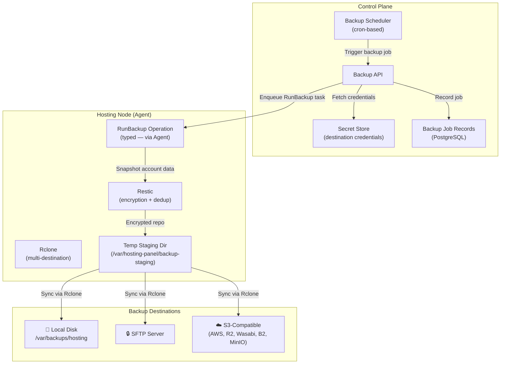
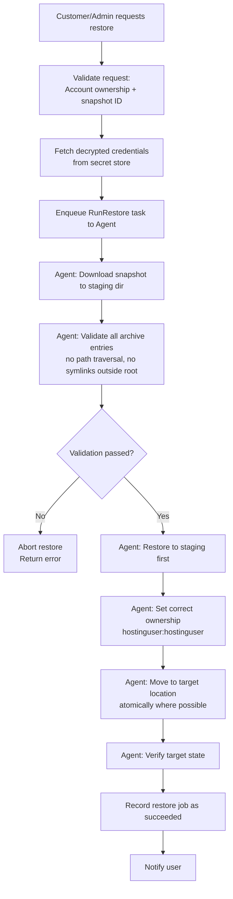

# Backup Architecture

> **Phase:** 1 | **Last Updated:** 2026-09-21

---

## Overview

The backup system is built on **Restic** (encrypted, deduplicated repositories) and
**Rclone** (multi-destination sync). It supports granular backups and restores at the
account, website, database, mailbox, and file level.

---

## Architecture Diagram



---

## Backup Scope

### Full Account Backup
Captures everything for one hosting account:

| Component | What is backed up |
|-----------|------------------|
| **Files** | All files under `/home/<username>/` |
| **Databases** | All databases owned by account (mysqldump / pg_dump) |
| **Mailboxes** | All mailbox data for account domains |
| **DNS Zones** | Zone files / PowerDNS records for account domains |
| **Config** | Nginx vhost config, PHP-FPM pool config, SSL cert metadata |
| **Node.js Apps** | App config and env var references (not secret values) |

### Granular Backup Types

| Type | Scope | Use Case |
|------|-------|----------|
| `full` | Everything above | Scheduled full backups |
| `files` | Files only | Quick file backup before risky operation |
| `database` | One or all DBs | Before DB schema changes |
| `mailbox` | One or all mailboxes | Mail-specific restore |
| `config` | Panel configuration only | Before config change |

---

## Backup Destinations

| Destination | Type | Notes |
|-------------|------|-------|
| Local disk | `local` | Fast; same-node risk |
| SFTP server | `sftp` | Key-based auth only; no password |
| AWS S3 | `s3` | Standard S3 API |
| Cloudflare R2 | `s3-compatible` | S3-compatible API |
| Wasabi | `s3-compatible` | S3-compatible API |
| Backblaze B2 | `b2` | Native B2 API via Rclone |
| MinIO | `s3-compatible` | Self-hosted S3 |
| Generic S3 | `s3-compatible` | Any S3-compatible endpoint |

### Destination Credentials Security
- All credentials stored **encrypted in Control Plane secret store**
- Credentials never sent to customer UI
- Credentials injected into Agent operation at runtime (not stored on node)
- Separate credentials per destination (no shared keys)
- Rotation supported without backup interruption

---

## Encryption

### Repository Encryption (Restic)
- Algorithm: **AES-256-GCM**
- Key: Restic repository password (stored encrypted in Control Plane)
- Every backup chunk is encrypted before leaving the node
- Encryption is transparent to the destination (S3/SFTP sees only ciphertext)

### Key Management
```
Control Plane Secret Store
    └── per-account repository password (generated at account creation)
    └── per-destination credentials

Agent receives repository password at runtime via task payload (encrypted channel)
Agent never stores repository password persistently
```

---

## Backup Schedule Policy

```
Default schedule (configurable per account/package):
  - Full backup:        Daily at 02:00 local time (staggered per node)
  - Retention:          7 daily, 4 weekly, 3 monthly
  - Integrity check:    Weekly
  - Restore test:       Monthly (optional, recommended)

Minimum recommended:
  - At least 1 offsite destination (not local only)
  - Encryption always enabled
  - Integrity verification at least weekly
```

---

## Integrity Verification

After each backup job:
1. **Checksum recorded** in `backup_jobs` table (SHA-256 of snapshot manifest)
2. **Restic check** runs to verify repository integrity
3. **Alert triggered** if verification fails

Weekly scheduled integrity scan:
- `restic check --read-data-subset=5%` — spot-checks 5% of data
- Full `restic check --read-data` monthly

---

## Restore Pipeline



### Restore Security Rules

| Rule | Implementation |
|------|---------------|
| Treat restore content as untrusted | All archive entries validated before extraction |
| No path traversal | Reject entries with `..` or absolute paths |
| No symlink escape | Detect and reject symlinks pointing outside account root |
| Bounded destination | Restore can only write to account's home directory |
| Wrong-tenant prevention | Snapshot ID verified against requesting account |
| DB restore safety | mysqldump import uses controlled process, not arbitrary SQL execution |
| Staging first | Always restore to temp staging, validate, then move |
| Ownership correction | All restored files owned by account Linux user |

---

## Alert Conditions

| Condition | Severity | Action |
|-----------|----------|--------|
| Backup job failed | High | Alert admin + account owner |
| No successful backup in > 24h (full) | High | Alert admin |
| Integrity check failed | Critical | Alert admin immediately |
| Backup destination unreachable | Medium | Alert admin |
| Restore job failed | High | Alert admin + requester |
| Disk space < 20% on local backup | Medium | Alert admin |

---

## Periodic Restore Test Design

For compliance and reliability, periodic restore tests are recommended:

```
Monthly restore test procedure:
1. Select random account backup from last 7 days
2. Create isolated test directory (not account home)
3. Run restore to test directory
4. Verify: file count matches, key files readable, DB import succeeds
5. Record test result in audit log
6. Clean up test directory
7. Alert if any test fails
```

This can be automated via a scheduled job in Phase 10.

---

## Backup Storage Estimation

| Accounts | Avg Size/Account | Daily Change | Local Storage | Offsite (after 30d) |
|----------|-----------------|-------------|---------------|---------------------|
| 10 | 5 GB | 2% | ~50 GB | ~50 GB |
| 100 | 5 GB | 2% | ~500 GB | ~500 GB |
| 1,000 | 5 GB | 2% | ~5 TB | ~5 TB |

Restic deduplication significantly reduces actual storage (typically 30–70% savings).

---

## Backup Data Classification

| Data Type | Sensitivity | Notes |
|-----------|------------|-------|
| Customer files | Medium-High | May contain customer PII |
| Database dumps | High | Contains all app data |
| Mailbox data | High | Contains private communications |
| Credentials in backups | Critical | Must never appear in plaintext |
| Panel config | Medium | Contains structural info, no secrets |

**Customer PII in backups:** Backups are encrypted; customer is responsible for
their application's data handling. Panel does not inspect backup content.
