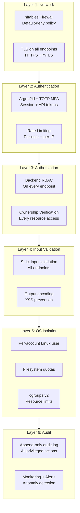

# Security Controls

> **Phase:** 1 | **Last Updated:** 2026-09-21

---

## Security Layers



---

## Authentication Controls

### Password Policy
- **Algorithm:** Argon2id (memory: 64MB, iterations: 3, parallelism: 4)
- **Minimum length:** 12 characters
- **Breached password check:** Optional (HaveIBeenPwned API, k-anonymity model)
- **History:** Last 5 passwords cannot be reused

### Multi-Factor Authentication (MFA)
- **TOTP:** RFC 6238 compatible (Google Authenticator, Authy, etc.)
- **Required for:** All Admin and SuperAdmin accounts
- **Optional for:** Reseller and Customer accounts
- **WebAuthn/Passkeys:** Architecture prepared; implementation in future phase
- **Backup codes:** 8 single-use codes generated at MFA enrollment

### Session Management
- **Token:** Cryptographically random, 256-bit
- **Storage:** Server-side (in Redis); only token hash stored
- **Cookie:** HttpOnly, Secure, SameSite=Strict
- **Expiry:** 24 hours (configurable)
- **Rotation:** New session token issued after privilege change (sudo, MFA)
- **Revocation:** Immediate, all sessions or specific session
- **Concurrent sessions:** Configurable limit per account

### API Token Security
- **Generation:** Cryptographically random, 256-bit
- **Storage:** Only SHA-256 hash stored in database; raw token shown once at creation
- **Scopes:** Fine-grained, explicitly defined (see PERMISSIONS.md)
- **Rotation:** Admin/owner can rotate at any time
- **Revocation:** Immediate
- **IP restriction:** Optional per-token allowlist
- **Expiry:** Optional expiry timestamp
- **Audit:** Every API token use logged

---

## Secret Management

### Secret Store
- All secrets stored encrypted at rest using AES-256-GCM
- Encryption key derived from master secret (stored outside application code)
- Secret store backed by: Environment variable injection (production) or Vault (optional)

### Secret Categories and Handling

| Secret Type | Storage | Rotation | In Logs? | In API? |
|-------------|---------|----------|----------|---------|
| User passwords | Argon2id hash in DB | On change | Never | Never |
| TOTP secrets | Encrypted in DB | On MFA reset | Never | Never |
| TLS private keys | Encrypted path in DB, file on disk | Certificate renewal | Never | Never |
| DB user passwords | Encrypted in DB | Supported | Never | Creation only |
| Mailbox passwords | Encrypted in DB | Supported | Never | Never |
| Node.js env vars | Encrypted in DB | On update | Never | Masked |
| Backup credentials | Encrypted in DB | Supported | Never | Never |
| API tokens | SHA-256 hash in DB | Supported | Never | Creation only |
| mTLS private keys | File on node (600) | Certificate rotation | Never | Never |
| Session tokens | SHA-256 hash in Redis | On each login | Never | Never |

### Log Redaction
All log output runs through a redaction filter that removes:
- `Authorization:` header values
- `Cookie:` and `Set-Cookie:` header values
- Fields named: `password`, `token`, `secret`, `key`, `credential`, `api_key`
- SMTP passwords, S3 secrets, SFTP keys

---

## Network Security

### Firewall (nftables)
Default policy: **DROP all inbound and outbound**

```nftables
table inet filter {
  chain input {
    type filter hook input priority 0; policy drop;
    ct state established,related accept
    ct state invalid drop
    iif lo accept
    tcp dport 80 accept comment "HTTP (ACME + redirect)"
    tcp dport 443 accept comment "HTTPS (customer sites)"
    tcp dport 8443 ip saddr @admin_ips accept comment "Panel UI/API"
    tcp dport 9090 ip saddr @control_plane_ips accept comment "Agent (mTLS)"
    tcp dport 22 ip saddr @admin_ips accept comment "SSH management"
    icmp type echo-request limit rate 10/second accept
    log prefix "DROPPED: " drop
  }
  chain forward {
    type filter hook forward priority 0; policy drop;
  }
  chain output {
    type filter hook output priority 0; policy accept;
    # Restrict outbound from agent process if needed (future enhancement)
  }
}
```

### Private Service Binding
| Service | Bind Address |
|---------|-------------|
| PostgreSQL | `127.0.0.1:5432` |
| Redis | `127.0.0.1:6379` |
| MariaDB | `127.0.0.1:3306` |
| PHP-FPM | Unix sockets only |
| Agent | `<node_private_ip>:9090` |

---

## Application Security

### CSRF Protection
- Synchronizer token pattern for browser-based requests
- Custom request header (`X-Panel-Request`) for API clients
- SameSite=Strict cookie attribute as defense in depth

### XSS Prevention
- All user-supplied content HTML-encoded before rendering
- Content-Security-Policy header (strict, no unsafe-inline)
- No `dangerouslySetInnerHTML` without explicit review and sanitization

### SQL Injection Prevention
- Parameterized queries for all database operations
- No string concatenation in SQL
- Database user has minimum required privileges (no `FILE`, no `SUPER`, no `GRANT OPTION`)

### Command Injection Prevention
- All subprocess/exec calls use argument arrays (never `sh -c "..."`)
- Fixed executable paths (no PATH lookup for privileged operations)
- All arguments strictly validated before passing to exec

### Rate Limiting
| Endpoint | Limit |
|----------|-------|
| Login | 10 attempts per 10 minutes per IP |
| MFA verification | 5 attempts per 5 minutes per user |
| Password reset | 3 requests per hour per email |
| API (authenticated) | 1000 requests per minute per token |
| WHMCS provisioning | 100 requests per minute |

---

## Hosting Isolation Security

### Linux User Isolation
- Unique Linux user per hosting account (format: `hosting_<random>`)
- Home directory: `/home/hosting_<id>/`
- Shell: `/usr/sbin/nologin` (no interactive login for hosting user)
- Web server runs as dedicated `www-data` or per-pool user

### PHP Isolation
- Separate PHP-FPM pool per hosting account
- Pool runs as account Linux user
- `open_basedir` set to account home directory
- `disable_functions`: `exec, passthru, shell_exec, system, proc_open, popen`
  (additional dangerous functions disabled)
- `expose_php = Off`

### Node.js Isolation
- PM2 runs app process as account Linux user
- Application root restricted to account home
- Internal port auto-allocated (range: 10000–60000)
- Binding: `127.0.0.1:<port>` only
- cgroups v2 resource limits applied

### cgroups v2 Limits (per account)
```
CPUQuota=<package_cpu_limit>%
MemoryMax=<package_ram_limit>
TasksMax=<package_process_limit>
IOReadBandwidthMax=/ 50M
IOWriteBandwidthMax=/ 50M
```

---

## Audit Log Security

### What is Logged
Every privileged operation records:
```json
{
  "id": "uuid",
  "actor_id": "uuid",
  "actor_role": "Customer",
  "action": "domain.create",
  "resource_type": "domain",
  "resource_id": "uuid",
  "ip_address": "1.2.3.4",
  "request_id": "req_01j8xyz",
  "result": "success",
  "metadata": {
    "domain_name": "example.com"
  },
  "created_at": "2026-09-21T10:00:00Z"
}
```

### What is NEVER Logged
- Passwords (even hashed)
- API tokens (even hashed)
- Session tokens
- TLS private keys
- Database credentials
- Backup credentials
- TOTP secrets

### Audit Log Protection
- Append-only table (no UPDATE, no DELETE permissions for application user)
- Separate DB user for audit writes with INSERT-only permission
- Optional: Remote log export to immutable storage (Phase 16)

---

## Security Monitoring (Phase 16 Preview)

Checks to implement in Security Center:
- [ ] SSH root login disabled
- [ ] Password authentication disabled (key-only)
- [ ] Panel MFA enabled for all admins
- [ ] Database not exposed publicly
- [ ] Redis not exposed publicly
- [ ] No open ports beyond defined policy
- [ ] SSL certificates not expiring within 14 days
- [ ] Backup job succeeded in last 24 hours
- [ ] Integrity verification passed in last 7 days
- [ ] No failed login spike (brute force detection)
- [ ] Node agents all reachable

---

## Incident Response (Template)

```
P1 — Critical (active compromise, data breach):   Respond within 15 minutes
P2 — High (suspected compromise, service down):   Respond within 1 hour
P3 — Medium (security misconfiguration found):    Respond within 4 hours
P4 — Low (non-critical security improvement):     Respond within 48 hours

Incident response steps:
1. Detect & alert
2. Contain (isolate affected component)
3. Assess (determine scope of impact)
4. Eradicate (remove attacker access)
5. Recover (restore from clean state)
6. Document & review (post-incident report)
```

*Assign contacts before going to production — see DISASTER_RECOVERY.md*
